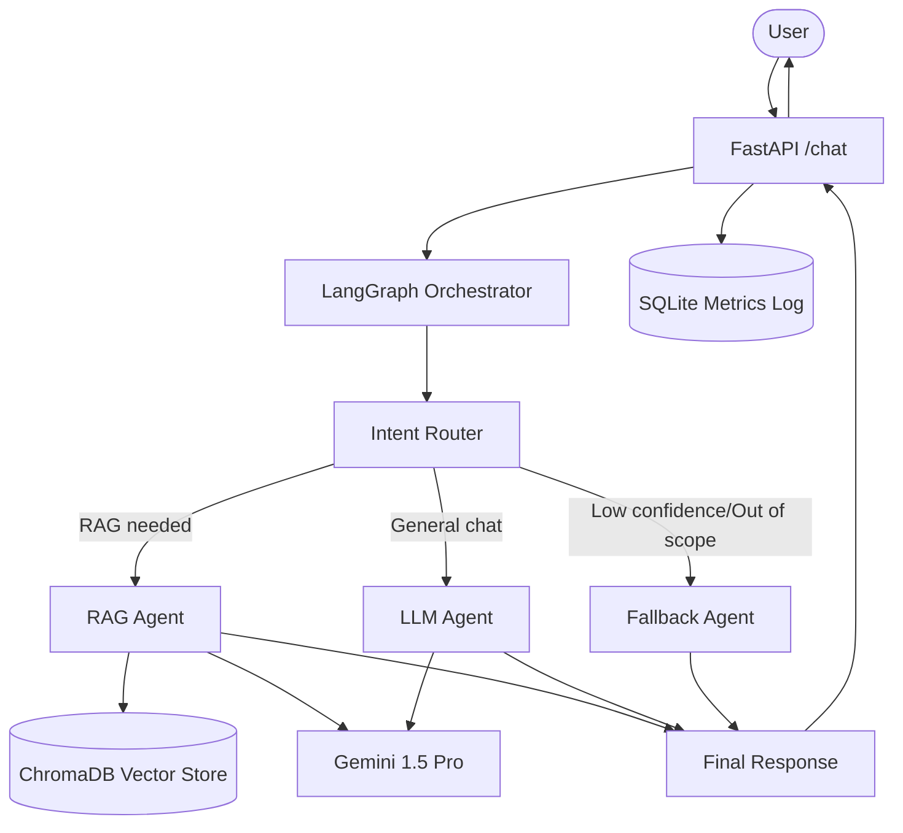

# Multi-Agent Conversational AI Orchestration Platform

A production-grade, scalable multi-agent platform using Gemini Pro, LangGraph, and FastAPI.

## Architecture



## Features
- **Intent Routing**: Analyzes user queries and routes them to the most appropriate specialized agent.
- **RAG Integration**: Local, free HuggingFace embeddings with ChromaDB for retrieving context.
- **Fallback Simulation**: Handles out-of-scope or low-confidence queries gracefully.
- **State Management**: LangGraph manages conversation state across turns and agents.
- **Evaluation**: Logs latency, confidence, and agent usage to a local SQLite database for offline evaluation.

## Setup Instructions

1. **Install Dependencies**
   ```bash
   python -m venv .venv
   .\.venv\Scripts\activate
   pip install -r requirements.txt
   ```

2. **Configure Environment**
   Create a `.env` file in the root directory:
   ```env
   GEMINI_API_KEY="your_google_ai_studio_api_key"
   ```

3. **Run Tests**
   ```bash
   pytest
   ```

4. **Run the Server Locally**
   ```bash
   uvicorn app.api.main:app --reload
   ```

5. **Interact via API**
   Open `http://127.0.0.1:8000/docs` to test the API in your browser.

## Deployment
This project includes a `Dockerfile` ready for deployment on free tiers like Render, Railway, or HuggingFace Spaces.
Just provide the `GEMINI_API_KEY` as an environment variable in your deployment platform.
